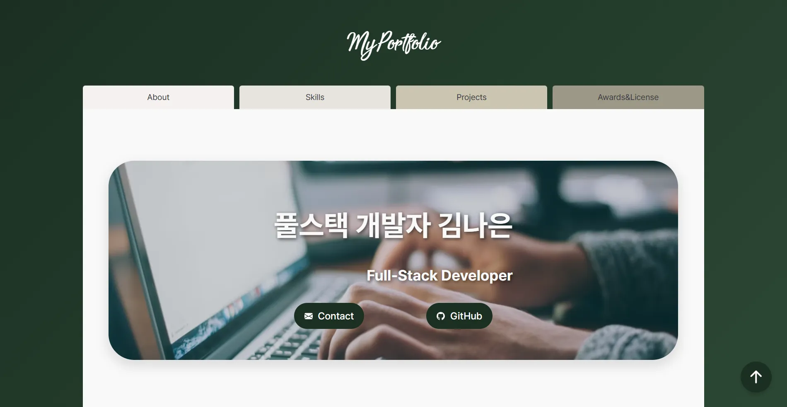

# 💻 김나은 | 풀스택 개발자 포트폴리오

> **"어제보다 더 발전하는 개발자"**  
> Python 데이터 분석부터 Java 백엔드, 프론트엔드까지 아우르는 풀스택 개발자 김나은의 포트폴리오 웹사이트입니다.

## 🔍 미리보기



## 🚀 배포 링크

- **Live Demo :** 웹사이트 바로가기
- **GitHub Repository :** 저장소 바로가기

## ⚒️ 사용 기술 (Skills)

!Static Badge !Static Badge

## 📁 디렉토리 구조

```text
├── index.html
├── css/
│     ├── reset.css
│     └── style.css
├── images/
│     ├── mbti.webp
│     └── profile.webp
└── README.md
```

## ⚙️ 주요 기능 (Implementation Details)

- 히어로
  - 백그라운드 이미지로 눈에 띄게 제작
  - 타이틀 텍스트가 잘 보일 수 있도록 text-shadow 활용

- 기본 프로필(About)
  - 주요 문구에 타이핑 애니메이션 적용
  - svg와 webp를 아이콘으로 활용
  - AI 이미지 활용

- 스킬 표시 막대그래프(Skills)
  - 보유 스킬 그래프화
  - 그래프 값을 그래프 내부 우측에 작성 -> 사용자 직관성 높임

- 프로젝트(Projects)
  - 줄 바꿈으로 글자깨짐 부분 처리(flexbox활용)
  - 다양한 프로젝트를 grid와 flexbox로 정렬
  - 각 프로젝트에 활용한 기술은 svg아이콘으로 시각화

- 상 및 자격증(Awards & Licenses)
  - 줄 바꿈으로 글자깨짐 부분 처리(flexbox활용)

- 연락(Contact)
  - form 활용 : mailto 속성으로 버튼을 누르면 이메일로 연결
  - (추후 해결해야할 이슈) JavaScript로 json 내용 전달 예정

## ⚠️ 개발 시 주요 고려 및 주의 사항 (Technical Considerations)

1. 반응형 디자인
   - 히어로가 미디어쿼리 사이즈 변화에 따라 변경
     - 데스크톱 사이즈(1024px ~) : 글자색 - #1b3022, 그림자 - rgba(255, 255, 255, 0.8)
     - 태블릿 사이즈(768px ~) : 글자색 - #f9f9f9, 그림자 - rgba(0, 0, 0, 0.7)
     - 모바일 사이즈(320px ~) : 그림자 제거, 백그라운드 이미지(세로로 긴 이미지) 변경, 버튼 내 텍스트 제거
   - 프로필 파트 변화
     - 모바일 사이즈(320px ~) : 이미지 제거, 애니메이션 제거
   - 프로젝트 파트 변화
     - 데스크톱 사이즈(1024px ~) : grid 사용

     ```
     grid-template-columns: repeat(2, 1fr);
     grid-template-rows: repeat(2, 1fr);
     ```

     - 태블릿 사이즈(768px ~), 모바일 사이즈(320px ~) : flexbox 활용

   - 상 및 자격증 파트와 연락 파트 묶음 부분 변화
     - 데스크톱 사이즈(1024px ~), 태블릿 사이즈(768px ~) : flexbox 활용
     - 모바일 사이즈(320px ~) : flexbox 활용(flex-direction column으로 변경)

2. 웹 표준 및 웹 접근성, SEO, 렌더링 측면 확인
   - svg만 사용한 아이콘일 경우 텍스트를 모두 sr-only클래스로 묶어 overflow : hidden을 적용

   - form에 focus ring 추가
   - reset.css에 prefers-reduced-motion: reduce 시 애니메이션 적용 해제 추가
   - cdn.jsdelivr.net와 images.unsplash.com에 대한 preconnect 추가
   - 헤더 내 탐색을 <nav>로 감싸 접근성 개선
   - GitHub 외부 링크에 rel="noopener noreferrer" 추가
   - form에 aria-label 추가

   - 모든 인라인 SVG에 aria-hidden="true" 및 focusable="false" 추가
   - 화살표 스크롤 버튼에 aria-label 추가

3. 애니메이션 효과
   - rise-up 애니메이션
     - 스크롤을 내릴때 부드럽게 다음 화면이 올라올 수 있게 하는 애니메이션
     - ref :
       토스메인,
       애플아이패드
   - typing 애니메이션 & caret 애니메이션
     - tying 애니메이션 : 키보드를 작성하는 듯한 느낌을 주는 애니메이션
       - infinite 속성 사용 : 애니메이션 무한 반복
       - 애니메이션을 width: 135% 마무리하게 하여 글자가 끝남과 동시에 바로 다시 시작하지 않게 조정
     - caret 애니메이션 : 커서가 깜박 거리는 느낌을 주는 애니메이션

## 💡 트러블슈팅 (Troubleshooting)

### 발생한 에러

1. 모바일 화면시 화면 깨짐 : 모바일 화면시 메인 클래스 화면이 왼쪽으로 치우쳐지면서 깨지는 현상 발생

2. svg아이콘 부재 & 이미지 확장자가 png : 필요한 아이콘의 svg가 없음(png확장자 이미지만 존재), 이미지 확장자가 png인 관계로 LCP 문제 발생

3. 저작권이 확실하지 않은 svg나 이미지 활용 필요 : 활용해야 할 이미지나 svg가 저작권 문제가 발생할 수 있는 문제 발생

### 문제해결

1. 확인 결과 애니메이션 특성 상 줄바꿈 불가로 메인클래스의 자식태그가 커지는 현상이 원인 -> 모바일 화면 시 애니메이션 삭제

2. png 이미지를 webp로 변환하여 사용

3. 각 이미지와 svg가 CC BY-ND인 관계로 footer에 출처를 추가로 작성
